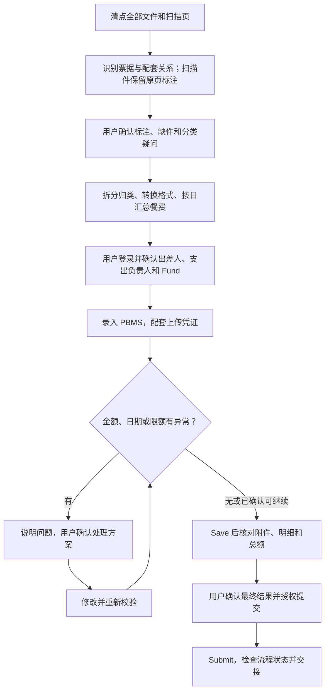

# HKUSTGZ Travel Reimbursement Skill

把差旅材料放进一个文件夹，交给 Agent 整理凭证、录入 PBMS、核对金额，并在你确认后提交。

适用于香港科技大学（广州）PBMS，支持中文、英文及其他语言界面。需要能读取本地文件、操作浏览器的 Agent 环境。

[下载 PDF 操作指南](docs/HKUSTGZ_PBMS自动报销操作指南.pdf)：包含材料准备、A4 粘贴示意、PBMS 上传截图和 Agent 操作流程。

## 1. 最简用法

每次出差新建一个文件夹，放入以下材料。

| 材料 | 放入文件夹的内容 |
| --- | --- |
| 出差审批 | 邮件审批截图或 DingTalk 出差审批文件。 |
| 全部费用材料 | 发票、receipt、机票行程单、登机牌、酒店水单、打车行程单、会议注册凭证等，保留全部页。 |
| 已有的辅助材料 | 会议或 workshop 通知、付款记录、汇率证明等。没有会议通知时，可让 Agent 查找官网。 |
| 纸质扫描件（如有） | 纸质材料不是必需的；如有，则必须扫描并放入文件夹。方法见下方“纸质材料准备”。 |

### 安装一次

在 Codex 中发送：

```text
请安装这个仓库中的 hkustgz-travel-reimbursement skill：
https://github.com/jayjunjieqiu/hkustgz-travel-reimbursement
```

### 每次报销

把材料文件夹拖入对话，或提供完整路径，然后发送：

```text
请使用 $hkustgz-travel-reimbursement 处理这个文件夹中的差旅报销：<文件夹路径>。
出差人是<姓名>，身份是<学生/教职工或 RA>，
支出负责人是<姓名>，Fund 是<经费号>。
```

按提示自行登录 [PBMS](https://pbms.hkust-gz.edu.cn/)，核对 Agent 提供的材料标注和待确认事项。录入完成后检查费用汇总，确认无误再让 Agent 提交。缺少的信息可以在对话中补充，密码和验证码直接在网页中填写。

**到这里即可开始。** 有纸质票据请先阅读下一节；想了解 Agent 的处理方式，可继续阅读第 3 节。

## 2. 纸质材料准备（如有）

没有纸质票据时跳过本节。如有，建议按日期和费用类型分组，平铺粘贴在 A4 纸上；餐费优先按日组织，纸张不必贴满。

1. 票据不重叠，日期、金额、币种、商户、票号和二维码均须可见。
2. 少量胶水涂在背面空白处。热敏票避免在文字面贴胶带，避免加热、过度涂胶。
3. 长票单独处理，不折叠遮住文字；需要分段扫描时保留重叠区域。
4. 日期、费用类型和页码写在底纸空白处，不覆盖票面。
5. 建议从约 300 dpi 彩色扫描开始，检查四边完整、无反光、文字可辨，再合并为完整 PDF。有内容的背面也要扫描。

纸质原件按学校要求保留和递交。更换完整版扫描件时告诉 Agent，重新核对页数、票据和汇总。

## 3. Agent 如何处理报销

### 3.1 流程总览



### 3.2 材料处理

扫描件先生成保留原页的标注版，在每张票旁标出编号、日期、币种、金额和类别。用户确认后再拆分；每页扫描件都必须归入对应材料，无法确定的会说明并询问。

餐费按票面日期每日一个 PDF，计算当日总额；多个币种分别汇总。所有文件留在本次报销目录：原件放“原始材料”，上传文件按费用类型建文件夹，标注版、清单和交接记录放 `output`，中间文件放 `tmp`。OFD 转换为可上传的 PDF，原始 OFD 保留。

### 3.3 系统录入

学生选择 Student Travel，教职工及 RA 选择 Travel Reimburse。Agent 核对实际出差人和人员 ID、Payee、职级、支出负责人及 Fund；总描述通常从出差审批复制。有纸质扫描材料时勾选 Paper Material Available。中文或其他语言界面按字段含义对照，无需切换语言。

| 费用 | 左侧 Invoice or receipt | 右侧 Attachment |
| --- | --- | --- |
| 国内打车 | 发票 | 对应行程单 |
| 海外打车 | 仅有行程单时放此处 | 有其他证明时补充 |
| 机票 | 机票凭证或电子行程单 | 对应登机牌、机票扫描件 |
| 住宿 | 发票或 receipt；仅有水单时使用水单 | 另有住宿明细时配套上传 |
| 会议 | 注册或收费凭证 | 对应会议或 workshop 通知 |

左侧必填，格式和大小按当前界面要求处理。接续跨市交通的出租车行程按本流程归入城市间交通；财务另有归类要求时按确认结果处理。

### 3.4 费用复核与异常处理

逐项核对 OCR 的日期、金额、币种和小数点。同一笔费用的发票与付款证明不能重复计入支出。

超限时先说明，再请用户确认是否按最高标准调整。限额按当日或对应期间合计，不能每张票分别套用完整日限额。调整后重新保存检查，备注保留实际金额、申报金额及调减原因。

真实付款日期无法通过校验时，先确认财务允许的处理方法。获准采用行程内归属日期及 PBMS 已折算的人民币金额时，备注保留实际日期、原币金额、人民币金额和“由 PBMS 系统折合”说明。

### 3.5 保存、提交与交接

- **Save Draft**：保存录入进度。
- **Save**：保存或更新 BR，在提交前页面核对附件、明细、备注和总额。重新打开的编辑窗口不显示已有附件时，到保存后的页面检查。
- **Submit**：用户明确授权后提交，随后读取流程状态，交接 BR 号、金额与待办事项。

会话过期后重新登录，通过 BR 号或草稿记录恢复，核实最新保存内容再继续。提交成功表示进入审核，不表示审批或付款完成。

## 参考文件

- [SKILL.md](hkustgz-travel-reimbursement/SKILL.md)：Agent 入口和工作顺序。
- [材料处理](hkustgz-travel-reimbursement/references/materials.md)：扫描标注、分类和凭证配套。
- [PBMS 操作](hkustgz-travel-reimbursement/references/pbms.md)：表单、多语言界面和草稿恢复。
- [核对与异常](hkustgz-travel-reimbursement/references/review.md)：限额、特殊口径及交接记录。

教职工通道已实操至提交预算审核；学生具体表单、签证费和后续付款流程尚未完整验证。本项目是社区工具，具体报销口径按学校和经办财务要求执行。

## 贡献与许可

欢迎通过 Issue 或 Pull Request 补充界面变化和可复现问题。请说明界面语言、操作步骤、预期与实际结果，并使用虚构数据；截图中的个人信息、二维码和文件下载链接应先不可逆遮盖，不要上传真实票据。

采用 [MIT License](LICENSE)。PBMS 及其他产品名称属于各自所有者。
